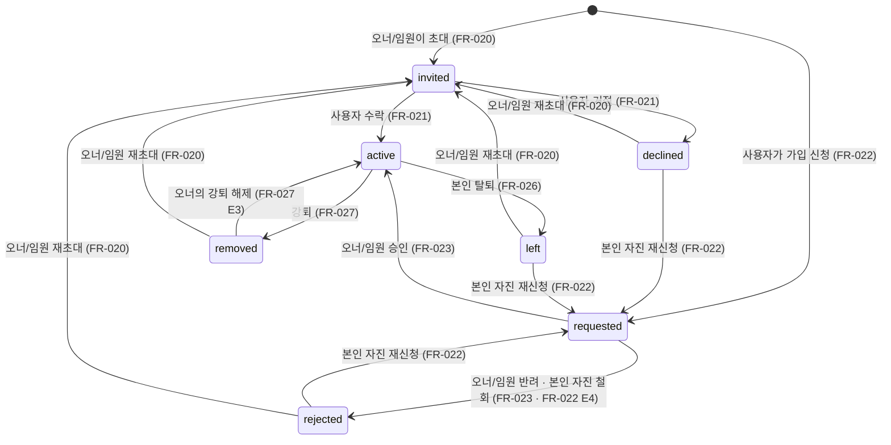

# I-040 확정 제안서 — 2.4절 멤버십 상태 다이어그램에 "신청 철회" 전이 반영 (29일차)

## 배경과 범위

사용자 결정: I-040에 D-083 방식(팀이 현행 구현 기준 확정안을 올리고 팀장이 승인)을 적용한다.
(C) 외부 입력 대기 5건 중 팀이 스스로 닫을 수 있는 유일한 항목이다.

I-040 내용(`docs/ISSUES.md`): `requirements.md` 2.4절 "Crew 멤버십 상태" 다이어그램이
`requested`에서 나가는 전이로 `approve_request`(→`active`)·`reject_request`(→`rejected`)
둘만 그리고 있어, 신청자 본인이 대기 중 신청을 스스로 철회하는 전이가 없다 — FR-022 E4·AC3와
불일치한다. 확정할 것 두 가지: ① 다이어그램에 철회 전이를 **어떤 모양으로** 넣을지, ②
**철회 후 재신청 가능 여부**.

**원칙(D-083 계승)**: 새 값을 발명하지 않는다. 현행 구현이 이미 답을 갖고 있으면 그 값을
그대로 확정안으로 올린다.

**조사 방법**: 코드는 `Read`/`grep`으로 직접 함수 본문을 읽어 확인했다(추정 금지 — 아래
"확인 결과" 절이 그 근거). DB에는 쓰지 않았다. 조회 시점: **2026-07-30(29일차)**,
git HEAD `f292fdf`, 이 절이 인용하는 파일들(`src/lib/data/supabase/join-request.ts`·
`src/lib/rules/join-request-eligibility.ts`·`src/lib/rules/crew-membership-transition.ts`)에
당시 uncommitted 변경 없음(`git status --short` 확인, `src/app/sample/page.tsx` 1건만
수정 중이었고 무관한 파일이다).

**교차 의존(중요)**: 이 제안은 "철회가 `crew_memberships`에 남기는 값이 `rejected`"라는
사실에 의존한다. **같은 회차에 CORE가 `withdrawJoinRequest`를 원자적 RPC로 교체 중**이며,
팀장 전달로는 "트랜잭션 경계만 바꾸고 값은 유지"가 목표라고 한다. 그 값이 실제로 바뀌면
(예: `withdrawn`을 멤버십 레벨에도 반영하도록 바뀌는 경우) 아래 확정안 중 ①·② 모두
재검토가 필요하다 — 이 제안서는 **2026-07-30 시점의 값**을 기준으로 한다.

---

## 확인 결과 — 현행 구현의 실제 동작 (추정 아님, 코드로 확인)

### ① `withdrawJoinRequest`가 `crew_memberships`에 쓰는 값

`src/lib/data/supabase/join-request.ts:123-150`:

```ts
export async function withdrawJoinRequest(
  id: Id,
  requesterId: Id,
): Promise<DataResult<JoinRequest>> {
  const supabase = await createSupabaseServerClient();
  const { data, error } = await supabase
    .from("join_requests")
    .update({ status: "withdrawn" })                 // ← join_requests: "withdrawn"
    .eq("id", id)
    .eq("requester_id", requesterId)
    .eq("status", "pending")
    .select("*")
    .maybeSingle();
  if (error) throw error;
  if (!data) return err("not_found", `join request ${id} 를 찾을 수 없다.`);

  const { error: membershipError } = await supabase
    .from("crew_memberships")
    .update({ status: "rejected" })                  // ← crew_memberships: "rejected"
    .eq("crew_id", data.crew_id)
    .eq("profile_id", requesterId)
    .eq("status", "requested");
  if (membershipError) throw membershipError;

  return ok(toJoinRequest(data));
}
```

**확인된 사실**: 이 함수는 두 개의 독립된 `UPDATE`를 실행한다(같은 파일 25-27행 docstring이
"철회는 그 트리거[`trg_join_requests_sync_membership_on_decision`]의 대상이 아니라서
`withdrawJoinRequest`가 직접 되돌린다"고 이미 밝혀 둠). **테이블별로 남는 값이 다르다**:

| 테이블 | 철회 시 값 | 오너/임원 반려 시 값 |
| --- | --- | --- |
| `join_requests.status` | `"withdrawn"`(구분됨) | `"rejected"`(`decideJoinRequest`, 같은 파일 97-120행) |
| `crew_memberships.status` | `"rejected"`(구분 안 됨) | `"rejected"` |

즉 **"누가·왜 끝냈는지"는 `join_requests` 레벨에서만 구분되고, 2.4절이 다루는
`crew_memberships` 상태 다이어그램 레벨에서는 철회와 반려가 완전히 같은 값(`rejected`)으로
합류한다** — `docs/ISSUES.md` I-040의 서술과 정확히 일치함을 코드로 재확인했다.

### ② `evaluateJoinRequestEligibility`가 `rejected` 상태를 어떻게 판정하는가

`src/lib/rules/join-request-eligibility.ts:33-61`:

```ts
export function evaluateJoinRequestEligibility(
  input: JoinRequestEligibilityInput,
): JoinRequestEligibility {
  const { crewVisibility, membership } = input;

  if (crewVisibility !== "public") {
    return { eligible: false, reason: "private_crew" };
  }

  switch (membership?.status) {
    case "active":
      return { eligible: false, reason: "already_member" };
    case "invited":
    case "requested":
      return { eligible: false, reason: "already_pending" };
    case "removed":
      return { eligible: false, reason: "banned" };
    case "declined":
    case "rejected":
    case "left":
    case undefined:
      // 초대 거절·과거 반려·자진 탈퇴·무관계는 전부 재신청 가능(FR-021 AC2 "영구 차단 아님"과
      // 같은 원칙 — FR-022는 강퇴만 명시적으로 차단한다).
      return { eligible: true };
  }
}
```

**확인된 사실**: `membership.status === "rejected"`는 `case "declined": case "rejected":
case "left": case undefined:` 분기(53-59행)에 걸려 `{ eligible: true }`를 반환한다 —
**`"banned"`(`removed` 전용)로 떨어지지 않는다.** 이 분기의 주석이 이유를 명시적으로 남겼다:
"FR-022는 강퇴만 명시적으로 차단한다." 철회로 도달했든 오너 반려로 도달했든 저장된 값은
둘 다 `"rejected"`이므로 **이 함수는 둘을 구분할 방법 자체가 없고, 구분하지 않은 채 둘 다
재신청 허용으로 판정한다.**

**보강 확인** — `src/lib/rules/crew-membership-transition.ts`의 상태 기계도 같은 결론:

```ts
// 118-121행
rejected: {
  reapply: "requested",
  reinvite: "invited",
},
// 126-129행 — removed만 reapply가 없다
removed: {
  reinstate: "active",
  reinvite: "invited",
},
```

`rejected`에는 `reapply → requested`가 있고(재신청 허용), `reapply`가 빠진 것은 `removed`
하나뿐이다(강퇴만 재신청 차단, FR-022 E3). 두 함수(판정 함수 + 상태 기계) 모두 같은
결론이므로 **"rejected니까 재신청 가능할 것"은 추정이 아니라 두 함수 본문을 직접 읽어
확인한 사실이다.**

### ③ 이미 준비돼 있던 정확한 문구 — 24일차(I-109/I-110)

`crew-membership-transition.ts` 파일 상단 docstring(24-25행)은 이미 이 정정을 위한 라벨을
써 두고 있었다:

```
requested --> rejected : 오너/임원 반려 · 본인 자진 철회 (FR-023 · FR-022 E4)
```

같은 docstring 14-17행이 "`requirements.md`의 다이어그램은 이번(23~24일차)에 고치지 않는다
— CORE가 같은 파일을 FR-063 건으로 동시에 고치고 있어 충돌을 피한다 ...
이슈(I-110, 부분 해결)에만 기록하고 다음 회차로 넘긴다"고 명시했다. **이번 회차(29일차)가
정확히 그 "다음 회차"다** — 코드가 이미 만들어 둔 라벨을 그대로 문서에 옮기면 된다.

---

## 확정 권고안

### 권고 1 — 다이어그램에 넣을 모양: 새 상태·새 이벤트 없음, 기존 엣지 라벨만 확장

**현행값 그대로 확정.** 새 상태(예: `withdrawn`)나 새 이벤트를 다이어그램에 추가하지 않는다.
기존 `requested --> rejected` 엣지 하나의 라벨만 위 ③의 문구로 바꾼다:

- **변경 전**: `requested --> rejected: 오너/임원 반려 (FR-023)`
- **변경 후**: `requested --> rejected: 오너/임원 반려 · 본인 자진 철회 (FR-023 · FR-022 E4)`

이유: 위 확인 결과 ①이 보이듯 **`crew_memberships` 레벨에서는 철회와 반려가 물리적으로
같은 값(`rejected`)에 합류한다** — 다이어그램이 표현하는 것은 "이 테이블의 상태 전이"이므로,
도달 경로가 둘이어도 도착 상태와 엣지가 하나면 라벨에 두 경로를 병기하는 것으로 충분하다.
새 상태를 만들면 코드가 실제로 구분하지 않는 것을 다이어그램만 구분하는 꼴이 되어 오히려
다이어그램과 코드가 어긋난다(2.4절이 "이 모듈이 2.4절의 단일 소스"라고 스스로 선언한
`crew-membership-transition.ts`와의 정합성이 깨진다).

### 권고 2 — 철회 후 재신청 가능 여부: 가능하다(현행 확정), 다이어그램 수정 불필요

**현행 동작(가능함) 그대로 확정.** 위 확인 결과 ②가 보이듯 `evaluateJoinRequestEligibility`와
`crew-membership-transition.ts`의 `TRANSITIONS.rejected.reapply` 둘 다 `rejected` 상태에서
재신청을 허용하며, 철회 경유분을 별도로 취급하지 않는다. **다이어그램 쪽에서 추가로 손댈
곳이 없다** — 이미 있는 `rejected --> requested: 본인 자진 재신청 (FR-022)` 엣지가 상태
기준으로 그려져 있어(도달 경로 불문), 권고 1의 라벨 변경만으로 "철회 후에도 이 엣지를 타고
재신청할 수 있다"는 그림이 자동으로 완성된다.

### 요구사항 문서에 그대로 붙일 수 있는 형태 (2.4절 mermaid 표기법 그대로)

`requirements.md` 2.4절의 stateDiagram-v2 블록(현재 183-201행) 중 **190행 한 줄만** 바뀐다.
전체 블록을 다시 붙이면:



블록 앞에 붙는 정정 각주도 기존 "24일차 정정(I-110)"·"25일차 추가(D-073, I-030)" 각주와
같은 서식으로 하나 더 추가할 것을 권고한다(팀장 병합 시 번호 채움):

> **29일차 추가(I-040)**: `requested --> rejected` 전이의 라벨에 "본인 자진 철회"를
> 병기했다. `crew_memberships` 레벨에서는 오너/임원 반려와 신청자 자진 철회가 같은 값
> (`rejected`)으로 합류한다(`withdrawJoinRequest`, `src/lib/data/supabase/join-request.ts:141-147`)
> — "누가 끝냈는지"의 구분은 `JoinRequest.status`(`pending → withdrawn`)가 담당하고
> 멤버십 상태 자체는 구분하지 않는다(D-0NN, 근거: `docs/decisions/
> join-request-withdrawal-diagram-i040.md`). 철회 후 재신청 가능 여부는 이미 있는
> `rejected --> requested` 엣지가 그대로 커버한다 — 별도 전이 추가 불필요.

---

## 비용까지 밝힌 대안 — 왜 채택하지 않는가

**정정(팀장 교차검증)**: 아래 "대안 A"는 애초에 이 절이 다뤘던 안이다. 그런데
`docs/ISSUES.md:560-562` I-040 원문 "후속" 절이 실제로 제안한 대안은 이것과 **다르다** —
원문은 상태(`withdrawn`)가 아니라 **이벤트(`withdraw_request`)만** 추가하고 도착 상태는
`rejected` 그대로 두는 안이다. 두 대안은 비용 구조가 다르므로 나눠서 판정한다. **대안 B가
I-040 원문이 실제로 제안한 것이다 — 이것을 다루지 않으면 원문 안을 정면으로 판정한 것이
아니다.**

### 대안 A — `crew_memberships`에 철회 전용 **상태**(예: `withdrawn`)를 새로 만들어 반려와 분리

이 안의 실제 비용:

1. `CrewMembershipStatus` 유니온 타입에 8번째 값 추가. `crew-membership-transition.ts`의
   `TRANSITIONS`는 `Record<CrewMembershipStatus, ...>`로 **7개 상태 전부를 컴파일 타임에
   강제**하므로(87행 주석 "다이어그램의 상태 하나를 빠뜨리면 컴파일 에러가 난다"), 새 상태를
   추가하는 순간 이 파일과 모든 `switch(status)` 소비처(`join-request-eligibility.ts`
   포함, exhaustive switch 여부에 따라 컴파일 에러 또는 조용한 undefined 분기)를 전부
   고쳐야 한다.
2. DB 쪽 — `crew_memberships.status`가 실제로 CHECK 제약이나 enum이라면 마이그레이션이
   필요하고, `crew_memberships_extend_self_service_join_request_transitions`·
   `crew_memberships_guard_self_transition`(23일차 I-109가 발견한 두 DB 트리거/제약,
   `crew-membership-transition.ts:6-8` 인용) 쪽에도 새 상태를 반영해야 한다 — 이번
   배정은 DB 쓰기가 금지돼 있어 실측하지 않았지만, 최소 두 곳의 DB 객체가 영향권에 있다는
   것은 기존 문서 인용만으로도 확인된다.
3. `evaluateJoinRequestEligibility`의 재신청 판정 분기를 다시 결정해야 한다 — 새 `withdrawn`
   상태가 `rejected`와 같은 재신청 허용 취급을 받을지 별도로 검토해야 하는데, 위 확인 결과
   ②가 이미 "FR-022는 강퇴만 차단한다"는 원칙으로 답을 내놓고 있어 **새 상태를 만들어도
   결론(재신청 허용)은 똑같이 나온다** — 즉 상태를 분리하는 비용에 대응하는 판정 결과의
   이득이 없다.
4. Task 017A(멤버 관리, 반려/강퇴 이력 화면 — `docs/ISSUES.md` I-040 "후속" 절이 이미 지목한
   화면)가 "반려됨" 목록에서 철회를 섞어 보여줄지 결정해야 하는데, **이 결정은 `crew_memberships`
   상태가 아니라 `join_requests.status`(`rejected` vs `withdrawn`, 이미 구분됨)를 조회하면
   그 화면만으로 해결된다** — 멤버십 상태를 쪼갤 필요가 없다.

**결론(대안 A)**: 비용(타입·DB·판정 로직 3중 변경)에 비해 이득(어차피 재신청 허용이라는 같은
결론, 그리고 "누가 끝냈는지"는 이미 `JoinRequest.status`가 구분함)이 없다 — **채택하지
않는다.**

### 대안 B — `crew_memberships`는 그대로 두고 `CrewMembershipEvent`에 **이벤트**(`withdraw_request`)만 추가 (I-040 원문 제안)

`docs/ISSUES.md` I-040 "후속" 절 원문: "`CrewMembershipEvent`에 `withdraw_request`를 더하고
`withdrawPendingCrewMembership`이 `rejected` 대신 이 새 이벤트를 쓰도록 고친다." 도착 상태는
그대로 `rejected` — 대안 A와 달리 `CrewMembershipStatus` 유니온·DB 트리거·판정 로직은
전혀 건드리지 않는다. 이 안을 판정하기 위해 팀장이 요청한 사실 두 가지를 코드로 확인했다.

**사실 1 — `CrewMembershipEvent`의 소비자가 몇 곳인가**:

```
$ grep -rn "CrewMembershipEvent" src --include=*.ts | grep -v "crew-membership-transition.ts"
(결과 없음)
```

`CrewMembershipEvent` 타입을 참조하는 코드는 **정의 파일(`crew-membership-transition.ts`)
자신뿐**이다. 다른 모든 호출부(`mock/crew.ts`의 `approveCrewMembership`·`rejectCrewMembership`
등, `mock/seed/generate-crews.ts`)는 `transitionCrewMembershipStatus(status, "approve_request")`
처럼 **이벤트를 리터럴 문자열로 직접 넘길 뿐, `CrewMembershipEvent`에 대해 `switch`를 돌리는
곳이 없다.** 즉 새 이벤트를 유니온에 추가해도 **망라성(exhaustiveness) 컴파일 오류가 나는
곳이 없다** — 이 관점만 보면 대안 A보다 훨씬 싸다(팀장이 지적한 대로).

**사실 2 — 실제 두 함수가 `TRANSITIONS`를 경유하는가, 상태값을 직접 쓰는가**:

- Mock `withdrawPendingCrewMembership`(`src/lib/data/mock/crew.ts:362-375`)는 **경유하지
  않는다** — 373행이 `membership.status = "rejected"`를 직접 대입한다. 반면 바로 위
  `rejectCrewMembership`(같은 파일 242-256행)은 250행에서
  `transitionCrewMembershipStatus(membership.status, "reject_request")`를 실제로 호출한다 —
  **같은 파일 안에 "경유하는 함수"와 "경유하지 않는 함수"가 나란히 있고, 철회 쪽이 후자다.**
- Supabase `withdrawJoinRequest`(`src/lib/data/supabase/join-request.ts:141-147`)도 **경유하지
  않는다** — `crew_memberships` 테이블에 `.update({ status: "rejected" })`를 직접 실행하는
  raw DB 호출이고, TS 쪽 `transitionCrewMembershipStatus`/`TRANSITIONS`를 아예 import하지
  않는다(파일 최상단 import 목록 참고, 이 모듈은 `crew-membership-transition.ts`를 import하지
  않음).

**판정(대안 B, 이번 회차 기준 기각)**: 팀장이 준 두 번째 사실이 정확히 들어맞는 경우다 —
**"경유하지 않는다면 이벤트를 추가해도 실행 경로가 달라지지 않고 표현만 늘어난다."** 지금
`withdraw_request`를 `CrewMembershipEvent`에 추가하고 `TRANSITIONS.requested`에
`withdraw_request: "rejected"` 한 줄을 넣는 것 자체는 컴파일 안전하고 저렴하다. 하지만 그것만
으로는 **어떤 실행 경로도 바뀌지 않는다** — Mock·Supabase 두 실제 철회 함수 모두 이 타입을
전혀 참조하지 않으므로, 이벤트를 추가해도 여전히 두 함수는 하드코딩된 `"rejected"` 대입을
계속한다. 이벤트가 "살아 있으려면"(실제로 호출되려면) 최소 `withdrawPendingCrewMembership`을
`transitionCrewMembershipStatus(membership.status, "withdraw_request")` 호출로 다시 쓰는
**코드 변경**이 함께 필요하고, Supabase 쪽까지 대칭을 맞추려면 `withdrawJoinRequest`도
같이 손대야 하는데 **그 파일은 이번 회차에 CORE가 원자적 RPC로 동시에 고치고 있어 읽기만
하라는 명시적 경계가 걸려 있다.** 이번 배정의 수락 기준 (d)도 "코드를 고치지 마라, 제안만
하라"고 못박았다 — 즉 대안 B를 지금 실질적으로 채택하려면 ① Mock 함수 재작성(경계 밖은
아니지만 이번 배정은 코드 변경 자체가 금지) ② Supabase 함수 재작성(CORE 소유, 명시적 금지)
이 함께 필요한데 이번 회차는 둘 다 할 수 없다.

**대안 B를 "영구 기각"이 아니라 "이번 회차 보류"로 남긴다**: 비용 자체(타입 추가)는 대안 A보다
훨씬 싸고 언젠가(Mock·Supabase 두 함수를 실제로 `TRANSITIONS` 경유로 재작성하는 후속 작업과
묶이면) 채택할 가치가 있을 수 있다. 다만 **지금 타입만 추가하면 "2.4절의 단일 소스"라고
스스로 선언한 `crew-membership-transition.ts`(파일 상단 docstring)에 어떤 실행 코드도 발생시키지
않는 죽은(dead) 이벤트가 생겨, 오히려 "이 모듈은 DB가 실제로 허용하는 전이를 반영한다"는 그
파일 자신의 선언과 어긋난다** — 23~24일차 I-109/I-110이 정확히 이 원칙(다이어그램·모듈·DB
세 곳을 실제 동작에 맞춰 정합시킨다) 때문에 존재했다는 점을 감안하면, 실행되지 않는 이벤트를
지금 끼워 넣는 것은 그 정합성 원칙에 반한다. **이번 회차 확정안은 대안 B를 채택하지 않는다** —
후속 작업(Mock·Supabase 철회 함수를 `TRANSITIONS` 경유로 재작성)으로 묶어 별도 이슈로
남길 것을 권고한다(아래 "확인하지 못한 것" 다음에 후속 이슈 후보로 기록).

**권고 1·2(라벨 확장만, 대안 A·B 모두 기각)**가 D-083 원칙("새 값을 발명하지 않는다")과
"모듈은 실제 동작만 반영한다"는 원칙(I-109/I-110) 둘 다에 부합하는 최소 비용 안이다 — 지금
코드가 실제로 하는 일(두 함수 모두 `"rejected"`로 직접 합류)을 다이어그램 라벨이 그대로
설명하는 것이 가장 정확하다.

---

## 확인된 사실 — Task 017A 화면이 이미 이 근사가 무해함을 증명한다 (CREW 교차검증, 팀장 독립 확인)

I-040 원문(`docs/ISSUES.md:558-559`)이 열어 뒀던 우려는 "**크루 설정의 '반려 이력' 화면이
나중에 생기면** 철회와 반려를 섞어 보여주는 게 맞는지 고객 확인이 없었다"였다. 이 우려는
**미래에 확인할 일이 아니라 이미 해소된 일**이다 — 그 화면(`JoinRequestPanel`, Task 017A)이
**9일차에 이미 만들어졌고, 처음부터 철회와 반려를 섞지 않았다.**

- `src/components/crews/JoinRequestPanel.tsx:38-40`(docstring) — "**'처리 내역' 탭이
  I-040을 해소한다** — `JoinRequest.status`의 `withdrawn`을 `rejected`와 같은 배지·문구로
  뭉개지 않고 '철회함'으로 따로 보여준다. 신청자 본인이 끝낸 건과 오너·임원이 반려한 건을
  관리자가 한눈에 구분할 수 있다."
- `src/components/crews/JoinRequestPanel.tsx:20-24`(`HISTORY_BADGE_VARIANT`) —
  `rejected: "outline"` / `withdrawn: "secondary"`로 배지 자체가 값 레벨에서 갈린다.
- `src/lib/strings/ko.ts:401,403` — `status.rejected: "반려됨"` / `status.withdrawn:
  "철회함"`(403행 위에 "I-040 — 신청자 본인이 철회한 건. '반려됨'과 다른 문구로 구분한다"
  주석까지 붙어 있다).
- `src/components/crews/crew-member-view-models.ts:41-43`(`JoinRequestRowViewModel`
  docstring) — "`status`가 4값(`pending`|`approved`|`rejected`|`withdrawn`)을 그대로
  옮긴다 — I-040이 요구하는 대로 '반려됨'과 '철회함'을 화면에서 구분해 보여주려면 이 타입이
  애초에 둘을 뭉개지 않아야 한다."
- **처음부터 그렇게 만들어졌다(나중에 덧붙인 게 아니다)**: `git log --diff-filter=A --oneline
  -- src/components/crews/JoinRequestPanel.tsx`와 `git log -S'withdrawn: "secondary"'
  --oneline -- src/components/crews/JoinRequestPanel.tsx` 둘 다 같은 단일 커밋
  `8c0b3e1`(2026-07-24, "Day 9: Phase 3 화면 3종 — 채팅 게시글 링크·멤버 관리·알림 센터
  (Task 020C·017A·023)")을 가리킨다.

**이것이 권고 1의 가장 직접적인 정당화다**: "`crew_memberships` 레벨에서 철회·반려를
`rejected` 하나로 합류시켜도 사용자에게 정보가 손실되지 않는다"는 주장을 이론이 아니라
**이미 작동 중인 화면으로** 증명한다. 그 구분을 담당하는 것은 애초에 `crew_memberships`가
아니라 `JoinRequest.status`였고, 화면은 처음부터 그 값으로 구분해 렌더해 왔다 — 그러니
2.4절 다이어그램(`crew_memberships` 상태 기준)이 둘을 한 엣지 라벨로 병기해도 사용자
경험에는 아무 영향이 없다.

---

## 확인하지 못한 것

- **DB 트리거/제약(`crew_memberships_extend_self_service_join_request_transitions`·
  `crew_memberships_guard_self_transition`)이 실제로 `requested → rejected`를 자진 철회
  경로에서도 허용하는지는 이번 회차에 SQL로 재확인하지 않았다** — DB 쓰기 금지 지시에 더해,
  이번 확인은 "코드(함수 본문)로 확인하라"는 수락 기준 (a)의 범위 안에서 마쳤다. 다만
  `withdrawJoinRequest`가 실제로 이 UPDATE를 실행해 커밋되는 경로임은 Task 032(18일차)·
  Task 038 계열 회차에서 이미 실측된 것으로 문서에 기록돼 있어(위 인용), 코드 확인만으로도
  결론의 신뢰도는 충분하다고 판단했다.
- **CORE가 이번 회차에 진행 중인 원자적 RPC 전환 이후에도 `crew_memberships.status` 값이
  `"rejected"`로 유지되는지는 CORE의 변경이 완료·커밋되기 전이라 재확인하지 못했다** — 팀장
  전달로는 "값은 유지, 트랜잭션 경계만 변경"이 목표라고 들었으나 이는 CORE의 의도이지 이
  제안서가 직접 확인한 사실은 아니다. 값이 실제로 바뀌면 이 제안서 전체(특히 위 "교차 의존"
  절)가 재검토 대상이다.

## 코드 변경 여부

**이번 배정에서 코드·DB·`requirements.md` 어느 것도 고치지 않았다.** 위 확인은 전부 읽기
전용이었고, `requirements.md` 반영은 팀장 승인 후 별도로 이뤄진다(수락 기준 (d)).
